# Đồ án tốt nghiệp

Đề tài: Phát triển ứng dụng web đặt đồ ăn cho nhà hàng sử dụng Next.js và .Net Core

## Tech Stack

**Client:** Nextjs, TailwindCSS

**Server:** .NET Core

**Pattern:** Monolith, Clean Architecture

## Features

- Light/dark mode toggle.
- Đăng nhập - đăng xuất - đổi mật khẩu.
- Quản lý đơn hàng: Chuyển đổi trạng thái, đặt đơn hộ khách.
- Quản lý bàn ăn: Đổi QR Code, ẩn bàn, chuyển đổi trạng thái, thêm, sửa, xóa,...
- Quản lý món ăn: Thêm, sửa, xóa, chuyển đổi trạng thái.
- Biểu đồ phân tích doanh thu.
- Quản lý tài khoản nhân viên.
- Realtime trạng thái món ăn.
- Khách hàng: đăng ký tài khoản, quét mã QR đặt món ăn.
- Upload hình ảnh liên quan.

## Demo

- API
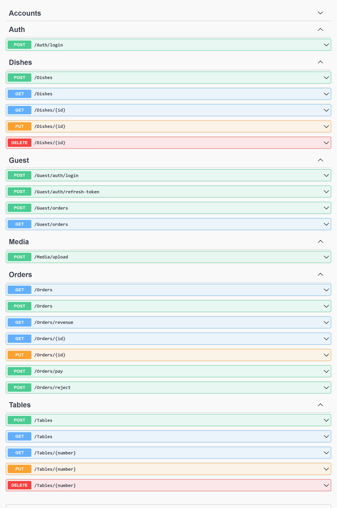

- UI for Quản lý và Nhân viên
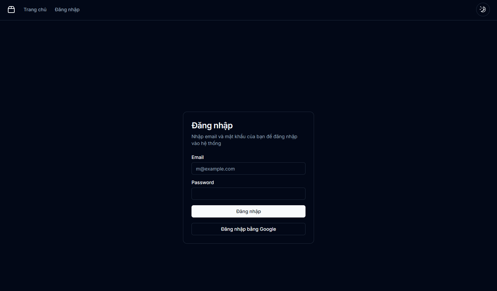
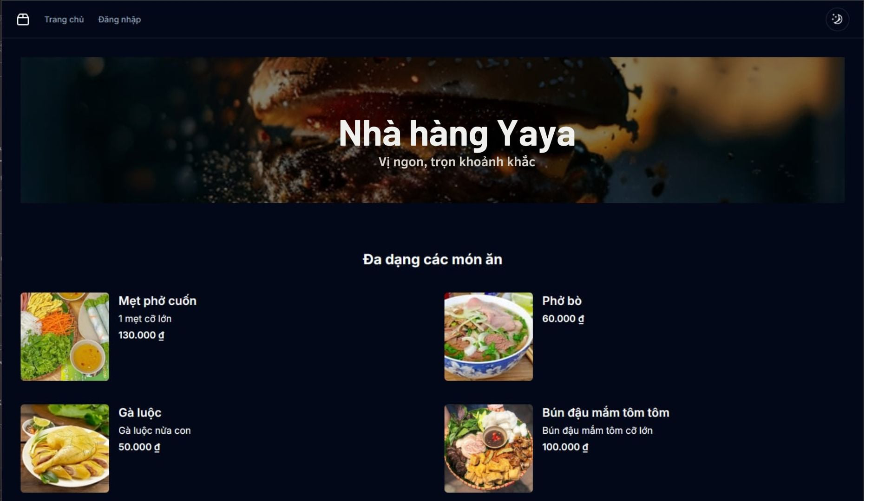
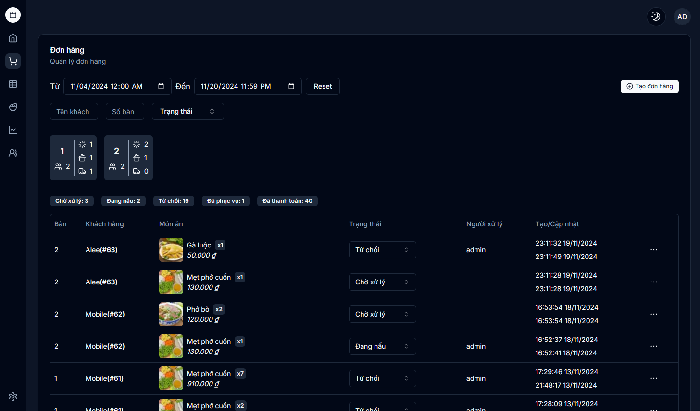
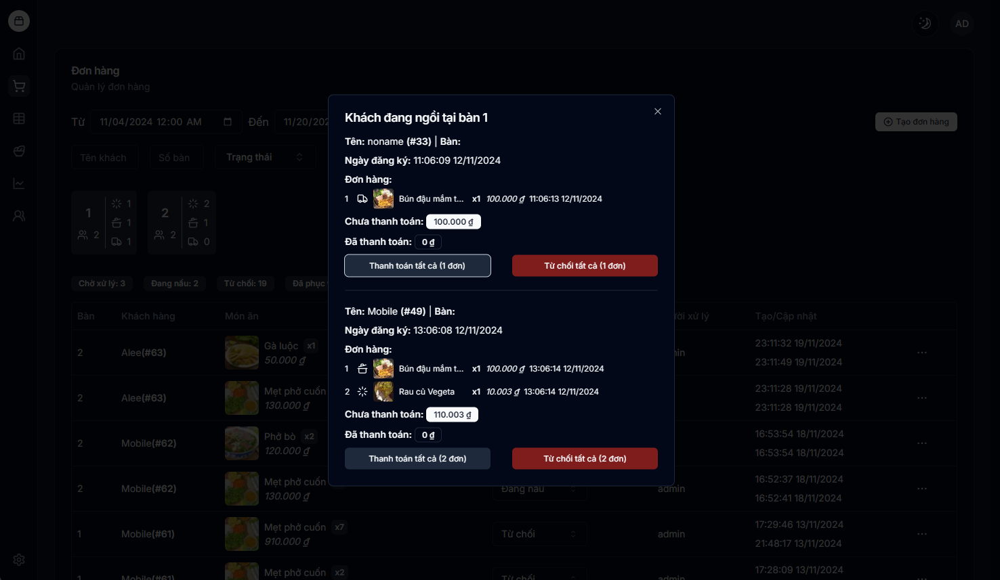
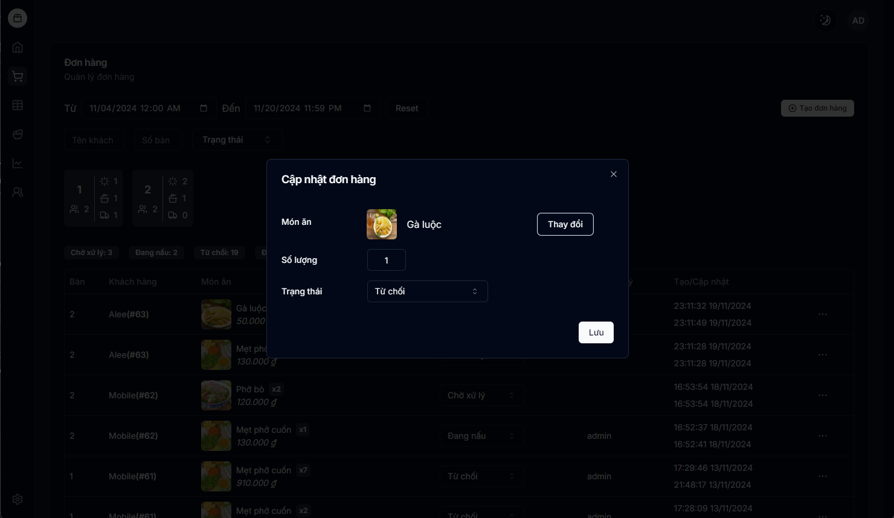
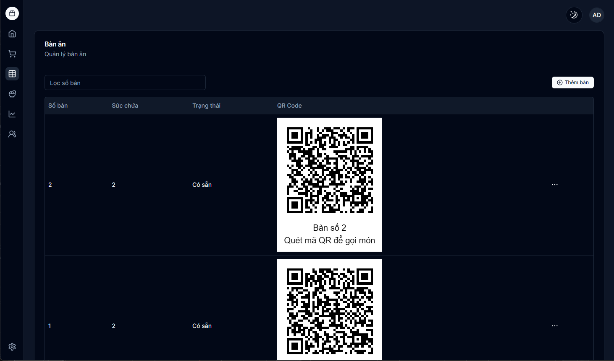
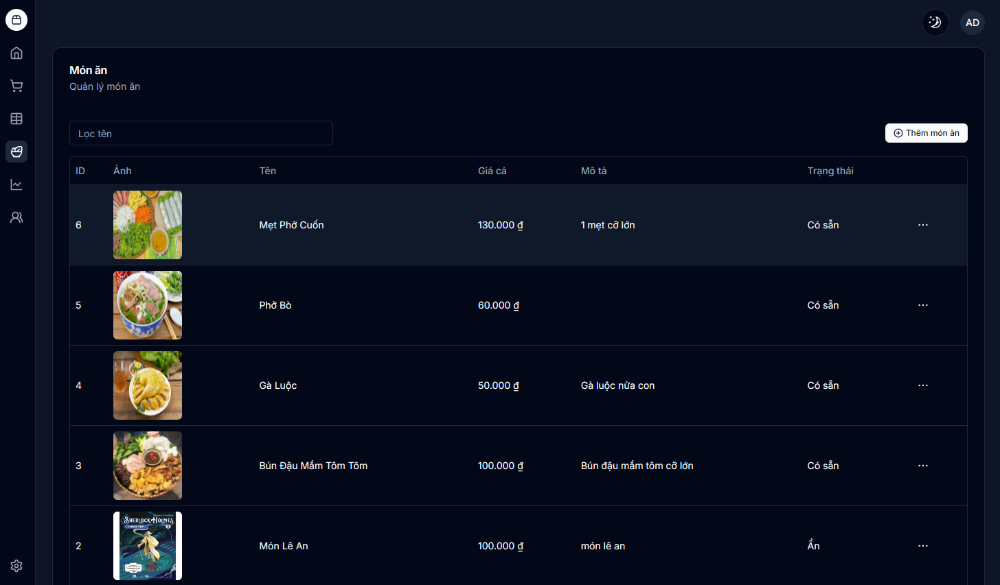
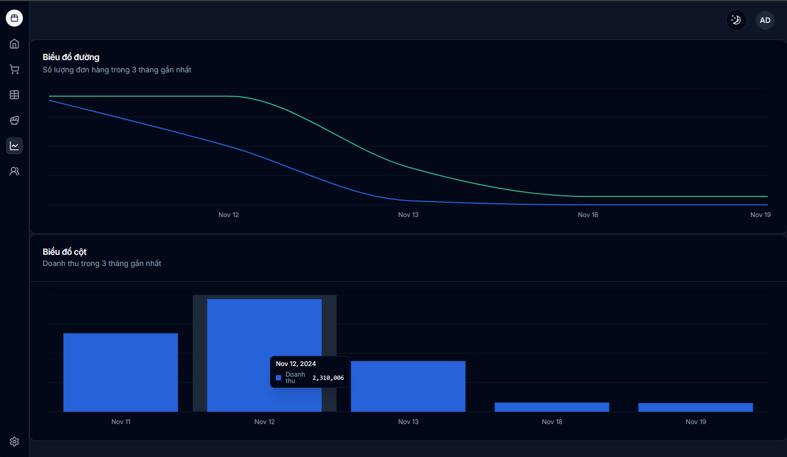
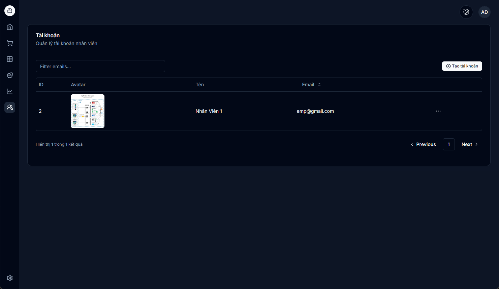

- UI for Guest - UI cho Khách hàng
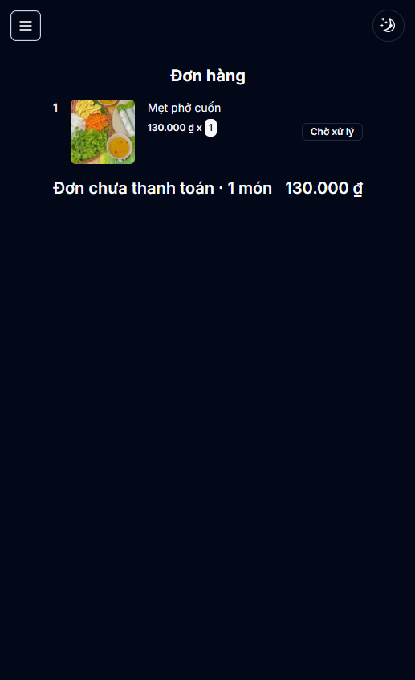
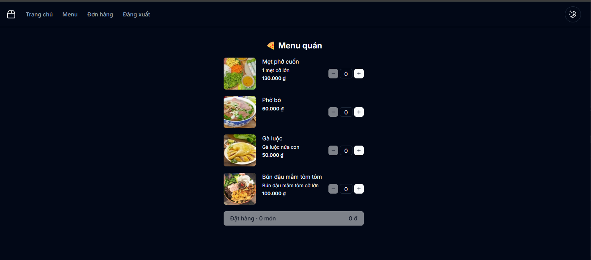

## Run Locally

Clone the frontend project

```bash
  git clone https://github.com/aleevan2812/DATN-Manage-Restaurant-Frontend
  npm install
  npm run dev
```

Clone the backend project

```bash
  git clone https://github.com/aleevan2812/DATN-Manage-Restaurant-Backend
  dotnet run
```

## License

[](https://choosealicense.com/licenses/mit/)
